  

# 🛡️ Awesome Software License Management ⚖️

  
  
  
  

## 🚀 Top Software License Management & Software Asset Management Ecosystem

A curated list of enterprise **Software License Management SaaS products**, **Software Asset Management (SAM)** platforms, **IT Asset Management (ITAM)** systems, and **Open-Source Software Composition Analysis (SCA) scanners**. 📊

Whether you are looking for cloud-native ITAM platforms, SaaS spend optimization tools, or open-source software license compliance scanning tools, this guide provides complete market intelligence, detailed pricing tier structures, company valuations, and repository metrics. 💡

**Last updated: October 2026** 📅

---

## 📑 Table of Contents
- [📈 Market Overview & Ecosystem Analysis](#-market-overview--ecosystem-analysis)
- [💼 SaaS & Hosted Enterprise Platforms](#-saas--hosted-enterprise-platforms)
- [🔓 Open-Source GitHub Projects](#-open-source-github-projects)
  - [💻 IT Asset & License Management (ITAM/SAM)](#-it-asset--license-management-itamsam)
  - [🔍 Open-Source License Compliance & SCA Scanners](#-open-source-license-compliance--sca-scanners)
  - [⚡ Additional Open-Source & Enterprise Options](#-additional-open-source--enterprise-options)
- [🎯 How to Choose the Right Solution](#-how-to-choose-the-right-solution)
- [🤝 How to Contribute](#-how-to-contribute)
- [💖 Support & Sponsorship](#-support--sponsorship)
- [⭐ Star History](#-star-history)
- [⚠️ Disclaimer](#%EF%B8%8F-disclaimer)

---

## 📈 Market Overview & Ecosystem Analysis

> 📌 **Estimated Market Size & Industry Structure:**  
> The global **Software Asset Management (SAM)** and **License Management** market is estimated at **\$4.6 Billion to \$5.2 Billion in 2026**, growing at a CAGR of **14.2%** (projected to reach over \$12 Billion by 2033).  
> 
> The sector is **moderately fragmented**: mega-cap cloud providers (AWS) and ITSM leaders (ServiceNow) dominate infrastructure and enterprise ITAM, while private equity-backed specialized giants (Flexera/Snow) control deep compliance, and venture-backed SaaS management solutions (Zylo, Torii) compete in the rapidly growing SaaS spend optimization niche. 🌐

---

## 💼 SaaS & Hosted Enterprise Platforms

The table below lists leading enterprise software license management and SaaS spend optimization platforms, ordered by **Company Scale / Market Valuation (Descending)**. 🏆

| SaaS Product | Description / Key Focus | Enterprise Starting Price | Free Tier / Trial Details | Company Valuation / Revenue Scale (Descending) |
| :--- | :--- | :--- | :--- | :--- |
| **[AWS License Manager](https://aws.amazon.com/license-manager/)** ☁️ | Centralized license tracking and rule enforcement across AWS and on-premises hybrid environments. | **\$0 service fee** (Pay only for underlying AWS infrastructure consumed, e.g. EC2 starting at \$0.0116/hr). | **AWS Free Tier**: 750 hours/month of EC2 t2.micro/t3.micro for 12 months; License Manager itself has no usage limit cap. | **~\$2.2 Trillion Market Cap** (Parent Amazon.com, Inc.) |
| **[ServiceNow SAM](https://www.servicenow.com/)** 🏢 | Enterprise ITAM & SAM suite integrated into ServiceNow ITSM for compliance, auditing, and SaaS reconciliation. | **~\$38,000 / year** (Enterprise licensing starting baseline for SAM Professional module). | **14-day dedicated sandbox trial** via ServiceNow Developer Program (PDI). | **~\$140 Billion Market Cap** (NYSE: NOW; \$13.28B Annual Revenue) |
| **[Flexera One](https://www.flexera.com/)** ⚙️ | Industry standard enterprise SAM, SaaS spend management, FinOps, and license compliance suite (includes Snow Software). | **~\$50,000 / year** (Minimum entry commitment for enterprise ITAM/SaaS modules). | **Custom guided proof-of-concept (PoC)** (No self-serve free tier; 14-to-30 day enterprise PoC available on request). | **~\$2.9 Billion Valuation** (Thoma Bravo PE backed; \$350M+ ARR) |
| **[USU License Management](https://www.usu.com/)** 💼 | Enterprise license management, SAM optimization, and compliance discovery across complex hybrid environments. | **~\$15,000 / year** (Starting annual platform subscription). | **30-day interactive demo environment** and enterprise trial upon sales consultation. | **~\$100 Million Valuation** (Publicly listed as USU Ventures AG / Thoma Bravo backed) |
| **[Zylo](https://zylo.com/)** 💸 | Dedicated SaaS management and optimization platform for discovering SaaS spend, contract renewals, and usage. | **~\$12,000 / year** (Starting tier for mid-market SaaS spend tracking). | **14-day enterprise trial** available upon request following platform demo. | **~\$72.5 Million Total Funding** (Series C backed by Baird Capital & Bessemer) |
| **[Torii](https://www.toriihq.com/)** 🔄 | Automated SaaS management platform for discovery, workflow automation, and subscription lifecycle tracking. | **~\$10,000 / year** (Starting annual tier for automated SaaS discovery). | **14-day full feature free trial** with automated cloud integration discovery. | **~\$65 Million Total Funding** (Series B led by Tiger Global) |
| **[Productiv](https://productiv.com/)** 📊 | SaaS intelligence platform for application engagement analytics and automated license procurement. | **~\$15,000 / year** (Historical baseline enterprise tier). | **14-day enterprise trial** with app engagement analytics preview. | **~\$73 Million Total Funding** (Series C led by IVP) |
| **[Certero](https://www.certero.com/)** 🛡️ | Unified ITAM, SAM, and SaaS spend management platform with automated asset discovery. | **~\$8,000 / year** (Starting pricing for mid-market SAM deployments). | **30-day full functional trial** with agentless network discovery. | **~\$5.3 Million Annual Revenue** (Bootstrapped / Independent) |
| **[Cleanshelf](https://www.cleanshelf.com/)** 🧹 | Automated SaaS spend tracker and license optimization platform (acquired by LeanIX / SAP). | **~\$5,000 / year** (Historical starting tier before SAP integration). | **14-day free trial** with automated financial transaction scanning. | **Acquired by LeanIX / SAP** (SAP parent valuation ~\$250B) |

---

## 🔓 Open-Source GitHub Projects

Below are top open-source software license management, IT asset management (ITAM), and Software Composition Analysis (SCA) compliance engines. 🛠️

All repositories include live **GitHub_Stars_Badges** and are sorted by **GitHub_Stars_Count (Descending)**. 🌟

### 💻 IT Asset & License Management (ITAM/SAM)

- **[Snipe-IT](https://github.com/snipe-it-org/snipe-it)**  🏷️  
  **The most widely adopted open-source IT asset management system** (AGPL-3.0). Built on Laravel 11 with a full REST API, Snipe-IT provides seat license assignments, check-in/check-out workflows, expiration tracking, and asset depreciation management. Best for SMBs and enterprise IT asset control.

- **[GLPI](https://github.com/glpi-project/glpi)**  📦  
  **The leading open-source ITIL & IT asset management platform** (GPL-3.0). Tracks software seat licenses, parent/child license relationships, renewal contracts, and over-quota alerts linked directly to hardware inventory. The primary open-source alternative to ServiceNow ITAM.

- **[Ralph](https://github.com/allegro/ralph)**  🖥️  
  **Open-source DCIM and asset management system** (Apache-2.0) built for data center infrastructure, physical hardware tracking, server rack visualization, and enterprise software license allocation.

- **[OCS Inventory Server](https://github.com/OCSInventory-NG/OCSInventory-Server)**  🛰️  
  **Automated agent-based software and hardware discovery engine** (GPL-2.0). Automatically inventories installed software across Windows, Linux, and macOS fleets to feed license compliance data into GLPI and Snipe-IT.

- **[Rudder](https://github.com/Normation/rudder)**  ⚓  
  **Open-source continuous configuration management and security compliance tool** (GPL-3.0). Includes node license verification and compliance rule enforcement across infrastructure fleets.

- **[openMAINT](https://github.com/openMAINT/openMAINT)**  🏗️  
  **Open-source enterprise facility and logistics asset management** (GPL-3.0) for managing physical assets, building infrastructure, and software license documentation across large operational environments.

---

### 🔍 Open-Source License Compliance & SCA Scanners

- **[ScanCode Toolkit](https://github.com/aboutcode-org/scancode-toolkit)**  🔎  
  **The industry-standard open-source license and copyright detection engine** (Apache-2.0). Scans source code and package manifests to detect licenses (with full SPDX identifier matching), copyright notices, and dependency obligations.

- **[OSS Review Toolkit (ORT)](https://github.com/oss-review-toolkit/ort)**  🧰  
  **The premier Linux Foundation open-source license compliance suite** (Apache-2.0). Resolves project dependencies across 20+ package managers, executes static license scans, enforces policy-as-code rules, and generates SPDX/CycloneDX Software Bill of Materials (SBOM).

- **[FOSSology](https://github.com/fossology/fossology)**  ⚖️  
  **The reference open-source license compliance toolkit** (GPL-2.0). Features a multi-user Web UI and database backend for license, copyright, and export control compliance clearing workflows with SPDX output.

- **[Licensee](https://github.com/licensee/licensee)**  📄  
  **Lightweight open-source license detector** (MIT) written in Ruby. Used by GitHub to detect open-source repository licenses by comparing `LICENSE` files against the choosealicense.com database.

- **[Licensed](https://github.com/github/licensed)**  🔒  
  **GitHub's open-source tool to cache and verify third-party dependency licenses** (MIT). Automates dependency license checking across multiple language ecosystems within CI/CD pipelines.

- **[Eclipse SW360](https://github.com/eclipse-sw360/sw360)**  🌐  
  **Centralized software component catalog and open-source license management hub** (EPL-2.0). Tracks software components, SBOM obligations, vulnerabilities, and integrates with FOSSology for compliance clearing.

- **[License Checker (NPM)](https://github.com/davglass/license-checker)**  ⚡  
  **CLI tool for scanning npm dependency licenses** (BSD-3-Clause). Extracts license details across Node.js package trees and outputs summaries for legal review.

- **[Tern](https://github.com/tern-tools/tern)**  🐳  
  **Open-source software package inspection tool for container images** (BSD-2-Clause). Finds software licenses and installed packages inside Docker container layers to produce SBOM reports.

---

### ⚡ Additional Open-Source & Enterprise Options

- **[ITSM-NG](https://github.com/itsmng/itsm-ng)** 🛠️ — Modern fork of GLPI providing complete ITSM, ITAM, and contract license tracking.
- **[CMDBuild](https://www.cmdbuild.org/)** 🏛️ — Open-source CMDB platform with asset lifecycle, software license tracking, and workflow management.
- **[iTop](https://github.com/Combodo/iTop)** 📋 — Open-source IT Service Management and CMDB tool with software license repository tracking.
- **[Syft](https://github.com/anchore/syft)** 📝 — CLI tool and Go library for generating a Software Bill of Materials (SBOM) from container images and filesystems.
- **[Trivy](https://github.com/aquasecurity/trivy)** 🛡️ — Comprehensive security scanner that includes license scanning for container images, code repositories, and OS packages.

---

## 🎯 How to Choose the Right Solution

1. **Purchased Software & Seat Tracking (ITAM/SAM):** 🎟️  
   - Choose **Snipe-IT** for straightforward hardware/software seat tracking.  
   - Choose **GLPI** or **ServiceNow SAM** for enterprise ITIL service management integrated with license contracts.
2. **Open-Source License Compliance & Software Bill of Materials (SCA):** 📜  
   - Choose **OSS Review Toolkit (ORT)** for automated multi-language CI/CD pipeline scans and policy-as-code enforcement.  
   - Choose **ScanCode Toolkit** or **FOSSology** for deep code analysis and legal clearance workflows.
3. **SaaS Spend Optimization & Subscription Discovery:** 💳  
   - Choose **Zylo** or **Torii** to discover unapproved SaaS subscriptions (Shadow IT) and optimize SaaS seat license usage.

---

## 🤝 How to Contribute

1. Fork the repository. 🍴
2. Add or update entries in `README.md` maintaining table formats and badge styles. 📝
3. Submit a Pull Request with factual documentation. 🚀

---

## 💖 Support & Sponsorship

If you find this list helpful for managing software licenses, IT asset management, or open-source compliance in your team or enterprise, please consider supporting the project! 🌟

- ⭐ **Star this repository** to help others discover it.
- 🔀 **Fork & Share** with your fellow IT Asset Managers, DevOps Engineers, and Compliance teams.
- ☕ **Buy me a coffee / Sponsor**: If you'd like to support ongoing research and list maintenance, consider sponsoring on [GitHub Sponsors](https://github.com/sponsors/ishandutta2007).

---

## ⭐ Star History

---

## ⚠️ Disclaimer

- This curated list is maintained by the community for informational and educational purposes.
- Software license scanners and ITAM platforms do not constitute legal advice. Always consult legal counsel regarding open-source license compliance and commercial contract obligations.
- **ITAM tools (GLPI, Snipe-IT)** manage seat quotas and hardware/software contracts; **SCA tools (ORT, ScanCode)** inspect source code for legal license obligations.

---

**Maintained with ❤️ for IT Asset Managers, DevOps Engineers, and License Compliance Officers.**

